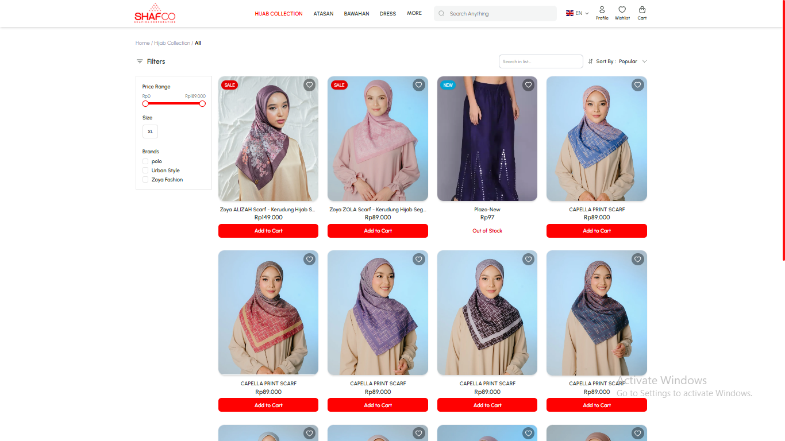
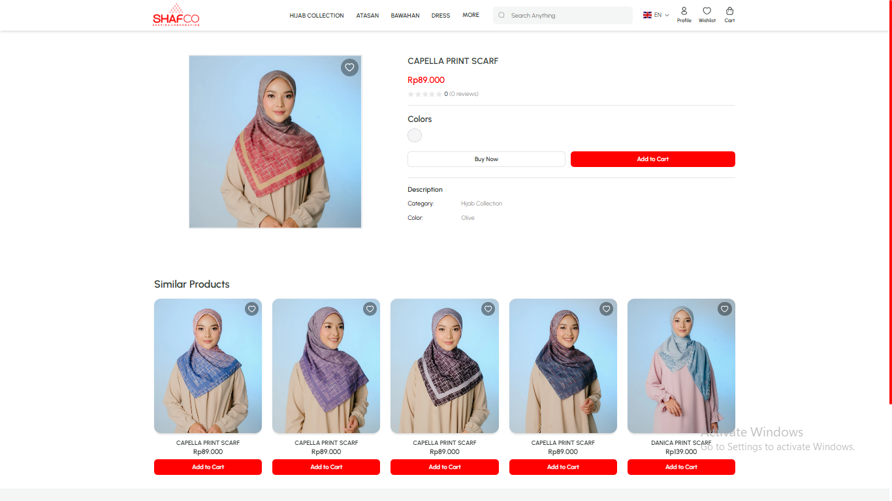

# 🛍️ Shafco Web

🔗 **Live Demo:** [https://gericht-by-jayf.netlify.app/](https://gericht-by-jayf.netlify.app/)

---

## ✨ Overview
**Shafco Web** is a modern **fashion eCommerce platform** built with **Next.js**, blending elegant design with lightning-fast performance.  
It delivers a seamless shopping experience for users while providing an intuitive admin interface for managing products and content.  

Designed with scalability, interactivity, and aesthetics in mind — Shafco brings high-end fashion retail to the digital space.

---

## 💡 Key Features
- 🧭 **Dynamic Product Catalog** – Browse, filter, and explore collections effortlessly  
- 👗 **Product Detail Pages** – View specifications, images, and pricing with smooth navigation  
- 🧑‍💻 **Admin Dashboard** – Manage products, add new sources, and update listings in real time  
- ⚡ **Optimized Performance** – Server-side rendering (Next.js) with TanStack Query caching  
- 🎨 **Polished UI** – Crafted with Tailwind CSS & ShadCN for a premium, modern aesthetic  
- 🔍 **SEO-Ready & Responsive** – Fully optimized for performance and mobile-first design  

---

## 🖼️ Screenshots

### 🏠 Home


### 🛒 Product List


### 🔍 Product Details


---

## ⚙️ Getting Started

To set up and run the project locally:

```bash
npm install --legacy-peer-deps
npm run dev
npm run build
